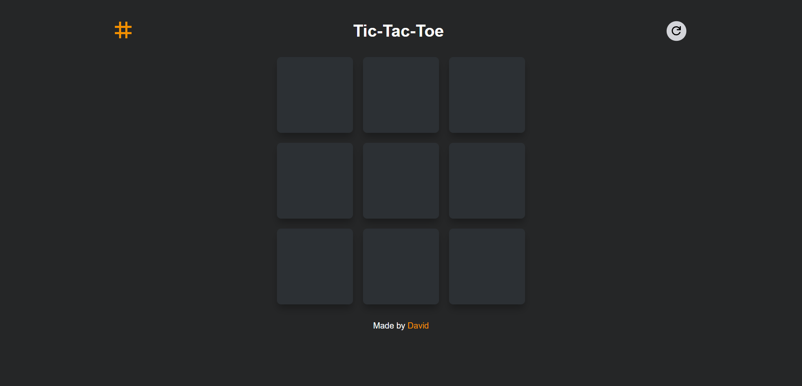

# JavaScript Tic Tac Toe
### MVP v1.0

This webpage is a simple tic-tac-toe game made to practice working with factory functions and IIFEs.

## Technologies Used
- HTML
- CSS (Grid, Flexbox)
- JavaScript

## What I learnt
- Using Factory functions.
- Working with IIFEs.

## Challenges and Future Improvements
- Addding a score tracker.
- Making quit and next round buttons work differently.
- Cleanup JS code.
